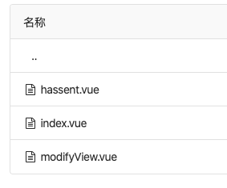
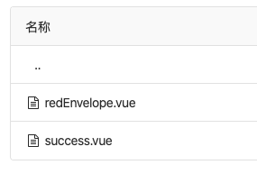

# Vue代码风格概要
> 参考文案 [Vue风格指南](https://cn.vuejs.org/v2/style-guide/)

# 目录

1. 必要
    1. [单文件组建文件的大小写](#单文件组建文件的大小写)
    2. [模版中的组件名大小写](#模版中的组件名大小写)
2. 建议
    1. [基础组件名](#基础组件名)
    2. [紧密耦合的组件名](#紧密耦合的组件名)
    3. [自闭合组件](#自闭合组件)
    4. [单文件组件内方法函数排序](#单文件组件内方法函数排序)
    5. [CSS样式书写BEM策略](#css样式书写bem策略)


## 单文件组建文件的大小写

> [参考链接](https://cn.vuejs.org/v2/style-guide/#%E5%8D%95%E6%96%87%E4%BB%B6%E7%BB%84%E4%BB%B6%E6%96%87%E4%BB%B6%E7%9A%84%E5%A4%A7%E5%B0%8F%E5%86%99-%E5%BC%BA%E7%83%88%E6%8E%A8%E8%8D%90)

等级: __必要__

反例
1. VGM组件命名-反例
    <br>
    <p>
    
    
    </p>

<br>
好例子

**「推荐」 单词大写开头 (PascalCase)**
或者
**横线连接 (kebab-case)**

```
components/
|- MyComponent.vue

components/
|- my-component.vue
```


## 模版中的组件名大小写

> [参考链接](https://cn.vuejs.org/v2/style-guide/#%E6%A8%A1%E6%9D%BF%E4%B8%AD%E7%9A%84%E7%BB%84%E4%BB%B6%E5%90%8D%E5%A4%A7%E5%B0%8F%E5%86%99-%E5%BC%BA%E7%83%88%E6%8E%A8%E8%8D%90)

等级: __必要__

```
<!-- 在单文件组件和字符串jsx,tsx模板中 -->
<MyComponent/>
<!-- 在 DOM 模板中 -->
<my-component></my-component>
或者

<!-- 在所有地方 -->
<my-component></my-component>
```

> 注意:<br>
> 单文件组件名 一定要与 组件内 `name` 字段相同,且最好使用 `PascalCase` 形式<br>
> 另外 减少使用 `Index.vue` , `Main.vue` 这种广义组件名

示例

```
// 
SearchSelectInput.vue

<template>
    ...
</template>

<script>
export default {
    name: 'SearchSelectInput',
    ...
}
</script>

<style scope>
...
</style>
```

## 基础组件名

> [参考链接](https://cn.vuejs.org/v2/style-guide/#%E5%9F%BA%E7%A1%80%E7%BB%84%E4%BB%B6%E5%90%8D-%E5%BC%BA%E7%83%88%E6%8E%A8%E8%8D%90)

等级: __建议__

反例

```
BaseComponents/
|- MyButton.vue
|- VueTable.vue
|- Icon.vue
```

好例子

```
components/
|- BaseButton.vue
|- BaseTable.vue
|- BaseIcon.vue

components/
|- AppButton.vue
|- AppTable.vue
|- AppIcon.vue
components/

|- VButton.vue
|- VTable.vue
|- VIcon.vue
```

## 紧密耦合的组件名

> [参考链接](https://cn.vuejs.org/v2/style-guide/#%E7%B4%A7%E5%AF%86%E8%80%A6%E5%90%88%E7%9A%84%E7%BB%84%E4%BB%B6%E5%90%8D-%E5%BC%BA%E7%83%88%E6%8E%A8%E8%8D%90)

等级: __建议__

```
components/
|- SearchSidebar.vue
|- SearchSidebarNavigation.vue
```


## 自闭合组件

> [参考链接](https://cn.vuejs.org/v2/style-guide/#%E8%87%AA%E9%97%AD%E5%90%88%E7%BB%84%E4%BB%B6-%E5%BC%BA%E7%83%88%E6%8E%A8%E8%8D%90)

```
<!-- 在单文件组件、字符串模板和 JSX 中 -->
<MyComponent/>
<!-- 在 DOM 模板中 -->
<my-component></my-component>
```


## 单文件组件内方法函数排序

> [参考链接](https://cn.vuejs.org/v2/guide/instance.html#%E7%94%9F%E5%91%BD%E5%91%A8%E6%9C%9F%E5%9B%BE%E7%A4%BA)

等级: __建议__

```
// 组件 script
export default {
    // 组件名
    name: '',

    // 组件属性
    props: {
        value: {
            type: String,
            default: '',
        }
    },

    // 调用的组件
    components: {},

    // 注入
    provide: {},

    // 分解
    inject: [],

    // 指令
    directive: {},

    // 混淆
    mixin: {},

    // 管道
    filter: {},

    // 数据data
    data () => {
        key: 'value',
    },

    // 计算属性
    computed: {
        getKey () {},
    },

    // 监听
    watch: {
        key (newValue, oldValue) {

        },
    }

    // vue 组件内 生命周期函数

    // 方法函数
    methods: {},
}
```


## CSS样式书写BEM策略

> [参考链接](https://github.com/getbem/getbem.com/)

示例

```html
<div class="b-popup-modal">
    <h1 class="b-popup-modal__title">title</h1>
    <div class="b-popup-modal__body">
        body
    </div>
    <div class="b-popup-modal__footer">
        <button class="b-btn b-btn--default">cancel</button>
        <button class="b-btn b-btn--primay">confirm</button>
    </div>
</div>
```
